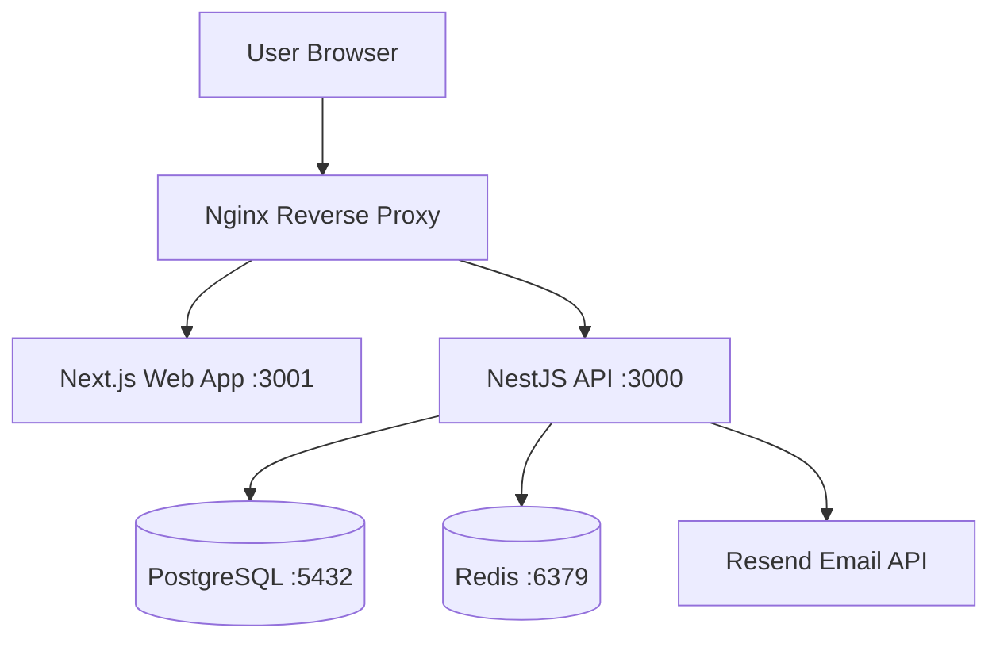
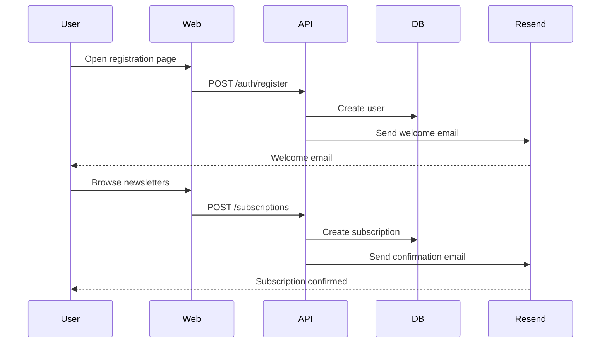
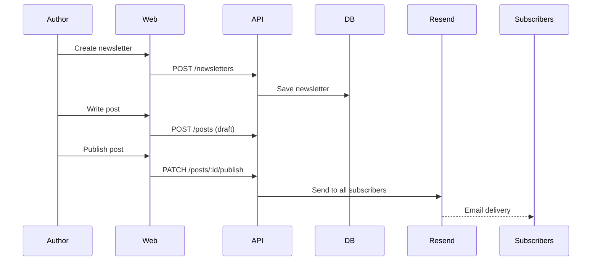

# /docs $ARGUMENTS

## Purpose

Generate professional, bilingual project documentation from source code,
existing docs, and development insights. Output: `README/rus/` and `README/eng/`.

## Step 1: Gather Context

Read all available sources to build comprehensive understanding:

### Primary sources (project documentation):
```
docs/PRD.md (or docs/*.md)          — product requirements, features
docs/Architecture.md                 — system architecture, tech stack
docs/Specification.md                — API, data model, user stories
docs/Completion.md                   — deployment, environment setup
docs/features/                       — feature-specific documentation
docs/plans/                          — implementation plans
CLAUDE.md                            — project overview, commands, agents
DEVELOPMENT_GUIDE.md                 — development workflow
docker-compose.yml                   — infrastructure services (PostgreSQL, Redis)
.env.example                         — environment variables
```

### Secondary sources (knowledge base):
```
myinsights/1nsights.md               — development insights index
myinsights/                          — detailed insight files
.claude/feature-roadmap.json         — feature list and statuses
```

### Tertiary sources (code analysis):
```
Source code structure                 — actual implementation
package.json (root + workspaces)     — dependencies, scripts, monorepo structure
apps/api/                            — NestJS backend
apps/web/                            — Next.js frontend
packages/shared/                     — shared types
packages/emails/                     — Resend email templates
README.md (existing, if any)         — current documentation
```

## Step 2: Determine Scope

```
IF $ARGUMENTS contains "rus":  languages = ["rus"]
ELIF $ARGUMENTS contains "eng": languages = ["eng"]
ELSE: languages = ["rus", "eng"]

IF $ARGUMENTS contains "update":
    mode = "update"  — read existing README/ files, update only changed sections
ELSE:
    mode = "create"  — generate from scratch
```

## Step 3: Generate Documentation Set

For EACH language in languages, generate these 7 files:

### File 1: `deployment.md` — Развертывание / Deployment Guide

```markdown
# Развертывание системы / Deployment Guide

## Требования к окружению
- Node.js 20+, Docker 24+, Docker Compose v2
- Minimum: 2 CPU, 4GB RAM, 20GB SSD
- VPS Russia (AdminVPS/HOSTKEY)

## Быстрый старт (Quick Start)
1. Clone repo
2. Copy `.env.example` → `.env` and fill values
3. `docker compose up -d`
4. Run migrations: `docker compose exec api npm run db:migrate`
5. Open http://localhost:3000

## Конфигурация Resend (Email)
- Set RESEND_API_KEY from resend.com dashboard
- Set FROM_EMAIL to verified sender domain

## Полное развертывание (Production Deployment)
- Infrastructure provisioning on VPS
- SSL/TLS via Nginx reverse proxy
- Database initialization and seeding
- Service startup order (PostgreSQL → Redis → API → Web)
- Health checks verification

## Обновление (Updating)
- Pull latest: `git pull`
- Rebuild and restart: `docker compose up -d --build`
- Apply migrations: `docker compose exec api npm run db:migrate`
- Rollback: `/deploy rollback`
```

### File 2: `admin-guide.md` — Руководство администратора / Admin Guide

```markdown
# Руководство администратора / Administrator Guide

## Управление пользователями
- User creation, roles (reader/author/admin), permissions

## Управление рассылками
- Newsletter creation and publishing
- Subscriber list management
- Email delivery via Resend — stats and monitoring

## Конфигурация системы
- Environment variables and their purposes
- Feature flags
- Redis cache configuration

## Мониторинг и логирование
- Docker logs: `docker compose logs -f api`
- System health: `GET /api/health`
- Database: `docker compose exec db psql -U postgres`

## Резервное копирование
- DB backup: `docker compose exec db pg_dump -U postgres substack_ru > backup.sql`
- Restore: `docker compose exec db psql -U postgres substack_ru < backup.sql`

## Устранение неполадок
- Common issues and solutions
- Diagnostic commands
```

### File 3: `user-guide.md` — Руководство пользователя / User Guide

```markdown
# Руководство пользователя / User Guide

## Начало работы
- Registration / Login
- Profile setup
- Subscribing to newsletters

## Для авторов
- Creating a newsletter
- Writing and publishing posts
- Managing subscribers
- Email delivery via Resend

## Для читателей
- Browsing newsletters
- Subscribing / unsubscribing
- Reading posts

## Типичные сценарии использования
- Common workflows step by step

## FAQ
- Frequently asked questions
```

### File 4: `infrastructure.md` — Требования к инфраструктуре / Infrastructure Requirements

```markdown
# Требования к инфраструктуре / Infrastructure Requirements

## Минимальные требования
- CPU: 2 cores
- RAM: 4GB
- Disk: 20GB SSD
- Network: 100 Mbps

## Рекомендуемые требования (production)
- CPU: 4 cores
- RAM: 8GB
- Disk: 100GB SSD
- Network: 1 Gbps

## Сетевые требования
- Port 80/443 (Nginx)
- Port 5432 (PostgreSQL — internal only)
- Port 6379 (Redis — internal only)
- Outbound HTTPS for Resend API

## Docker Services
- `api`: NestJS backend (port 3000)
- `web`: Next.js frontend (port 3001)
- `db`: PostgreSQL 16 (port 5432)
- `redis`: Redis 7 (port 6379)
- `nginx`: Reverse proxy (port 80/443)

## Зависимости
- Resend account for email delivery (resend.com)
- Domain with DNS A record pointing to VPS
- SSL certificate (Let's Encrypt recommended)
```

### File 5: `architecture.md` — Архитектура системы / System Architecture

```markdown
# Архитектура и принципы работы / Architecture & Design Principles

## Обзор архитектуры

Distributed Monolith (Monorepo) — все сервисы в одном репозитории,
деплоятся как отдельные Docker-контейнеры.



## Технологический стек

| Layer | Technology | Purpose |
|-------|-----------|---------|
| Frontend | Next.js (App Router) | SSR web application |
| Backend | NestJS | REST API + business logic |
| Database | PostgreSQL 16 | Primary data store |
| Cache/Queue | Redis 7 | Sessions, job queues |
| Email | Resend | Transactional emails |
| Containers | Docker + Compose | VPS deployment |
| Infrastructure | AdminVPS/HOSTKEY | Russian VPS hosting |

## Компоненты системы
- NestJS modules: Auth, Newsletter, Subscription, Email, User
- Next.js: App Router pages, Server Components
- Shared packages: types, utilities, email templates

## Безопасность
- JWT authentication
- bcrypt password hashing
- Resend API key stored in environment only
- PostgreSQL with parameterized queries
```

### File 6: `ui-guide.md` — Интерфейс системы / UI Guide

```markdown
# Интерфейс системы / UI Guide

## Структура интерфейса
- Main navigation: Home, Browse, My Newsletters, Profile
- Author dashboard: Create, Manage subscribers, Analytics

## Основные экраны
- Landing page / Home feed
- Newsletter detail page
- Post reader
- Author dashboard
- Subscription management

## Элементы управления
- Common UI patterns (Next.js App Router, Server Components)
- Responsive layout (mobile-first)
- Dark/Light mode support

## Локализация
- Primary language: Russian
- Secondary: English (toggle)
```

### File 7: `user-flows.md` — Пользовательские сценарии / User & Admin Flows

```markdown
# Типовые сценарии / User & Admin Flows

## User Flow: Регистрация и подписка



## Author Flow: Создание и публикация рассылки



## Admin Flow: Мониторинг системы
- Check service health: `docker compose ps`
- View logs: `docker compose logs -f api`
- Monitor Resend delivery: Resend dashboard
- DB queries: `docker compose exec db psql`
```

## Step 4: Generate Output

1. Create directory structure:
```bash
mkdir -p README/rus README/eng
```

2. Generate files for each language:
   - Russian files go to `README/rus/`
   - English files go to `README/eng/`
   - Use proper language throughout (not machine-translated fragments)
   - Adapt Mermaid diagrams for each language where labels differ

3. Generate `README/index.md` — table of contents linking both languages:

```markdown
# SubStack RU — Documentation

## Документация на русском
- [Развертывание](rus/deployment.md)
- [Руководство администратора](rus/admin-guide.md)
- [Руководство пользователя](rus/user-guide.md)
- [Требования к инфраструктуре](rus/infrastructure.md)
- [Архитектура](rus/architecture.md)
- [Интерфейс](rus/ui-guide.md)
- [Пользовательские сценарии](rus/user-flows.md)

## English Documentation
- [Deployment Guide](eng/deployment.md)
- [Administrator Guide](eng/admin-guide.md)
- [User Guide](eng/user-guide.md)
- [Infrastructure Requirements](eng/infrastructure.md)
- [Architecture](eng/architecture.md)
- [UI Guide](eng/ui-guide.md)
- [User & Admin Flows](eng/user-flows.md)
```

## Step 5: Commit and Report

```bash
git add README/
git commit -m "docs: generate project documentation (RU/EN)"
git push origin HEAD
```

Report:
```
📚 Documentation generated: README/

🇷🇺 Russian (README/rus/):
   ✅ deployment.md — развертывание
   ✅ admin-guide.md — руководство администратора
   ✅ user-guide.md — руководство пользователя
   ✅ infrastructure.md — требования к инфраструктуре
   ✅ architecture.md — архитектура
   ✅ ui-guide.md — интерфейс
   ✅ user-flows.md — пользовательские сценарии

🇬🇧 English (README/eng/):
   ✅ deployment.md — deployment guide
   ✅ admin-guide.md — admin guide
   ✅ user-guide.md — user guide
   ✅ infrastructure.md — infrastructure requirements
   ✅ architecture.md — architecture
   ✅ ui-guide.md — UI guide
   ✅ user-flows.md — user & admin flows

📄 README/index.md — documentation index
```

## Update Mode

When `$ARGUMENTS` contains "update":
1. Read existing files in `README/rus/` and `README/eng/`
2. Compare with current project state (re-scan sources)
3. Update only sections that have changed
4. Preserve any manual additions (sections not in template)
5. Commit: `git commit -m "docs: update project documentation"`

## Notes

- Documentation is generated from ACTUAL project state, not assumptions
- Mermaid diagrams are used for architecture and flow visualizations
- SubStack RU-specific: always mention Resend for email, AdminVPS/HOSTKEY for infra
- If UI doesn't exist yet, ui-guide.md notes this and describes planned UI
- myinsights/ is checked for gotchas and important notes to include
- Russian is the primary language — Russian files should be more detailed
