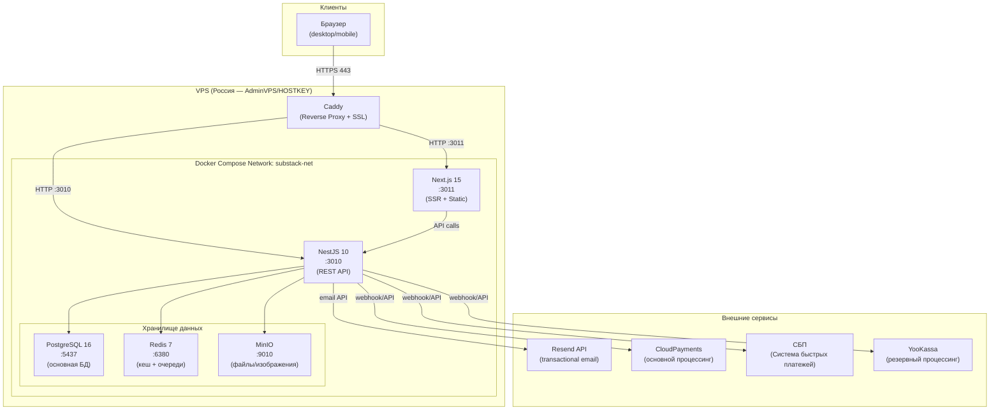

# Архитектура системы SubStack RU

## Паттерн: Распределённый монолит

SubStack RU реализован по паттерну **Distributed Monolith (Monorepo)**:
- Единый git-репозиторий содержит backend, frontend и shared-пакеты
- Деплой через Docker Compose на один VPS
- Модули изолированы внутри NestJS, но работают в едином процессе
- Горизонтальное масштабирование возможно на Phase 3 без смены архитектуры

Паттерн выбран для MVP как оптимальный баланс между простотой деплоя и возможностью роста.

---

## Диаграмма системы



---

## Технологический стек

| Слой | Технология | Версия | Назначение |
|------|-----------|--------|-----------|
| **Frontend** | Next.js | 15.x | SSR, статические страницы, App Router |
| **Frontend** | React | 19.x | UI компоненты |
| **Frontend** | TypeScript | 5.x | Типизация |
| **Frontend** | Tailwind CSS | 4.x | Утилитарные стили |
| **Frontend** | TipTap | 2.x | Редактор статей (rich text) |
| **Frontend** | Zustand | 5.x | Клиентский state management |
| **Backend** | NestJS | 10.x | REST API framework |
| **Backend** | TypeScript | 5.x | Типизация |
| **Backend** | Prisma ORM | 5.x | ORM + миграции |
| **Backend** | Bull | 4.x | Очереди задач (email, payments) |
| **Backend** | Passport.js | — | JWT стратегия аутентификации |
| **База данных** | PostgreSQL | 16.x | Основное хранилище данных |
| **Кеш/Очереди** | Redis | 7.x | Кеш + Bull job queues |
| **Файлы** | MinIO | latest | S3-совместимое хранилище |
| **Email** | Resend | API | Транзакционные письма |
| **Платежи** | CloudPayments | API | Карты, рекуррентные платежи |
| **Платежи** | СБП | НСПК | QR-коды, быстрые переводы |
| **Платежи** | YooKassa | API | Резервный провайдер |
| **Proxy** | Caddy | 2.x | Reverse proxy + SSL/TLS |
| **Контейнеры** | Docker + Compose | 24.x + 2.20 | Оркестрация сервисов |

---

## Структура монорепозитория

```
substack-ru/
├── packages/
│   ├── backend/           # NestJS 10 приложение
│   │   ├── src/
│   │   │   ├── auth/      # Аутентификация и авторизация
│   │   │   ├── publications/  # Управление публикациями
│   │   │   ├── articles/  # Статьи и редактор
│   │   │   ├── subscriptions/ # Подписки (free + paid)
│   │   │   ├── payments/  # Платёжные вебхуки
│   │   │   ├── payouts/   # Выплаты авторам
│   │   │   ├── email/     # Resend интеграция
│   │   │   ├── analytics/ # Метрики авторов
│   │   │   ├── recommendations/ # Рекомендации читателей
│   │   │   ├── referrals/ # Реферальная программа
│   │   │   ├── tips/      # Донаты авторам
│   │   │   └── admin/     # Административный модуль
│   │   └── prisma/        # Схема БД и миграции
│   ├── frontend/          # Next.js 15 приложение
│   │   └── src/app/
│   │       ├── page.tsx           # Лендинг
│   │       ├── login/             # Страница входа
│   │       ├── register/          # Страница регистрации
│   │       ├── dashboard/         # Дашборд автора
│   │       │   ├── page.tsx       # Обзор (аналитика)
│   │       │   ├── articles/      # Список статей
│   │       │   ├── editor/        # Редактор статей
│   │       │   ├── subscribers/   # Список подписчиков
│   │       │   ├── payouts/       # Выплаты
│   │       │   └── settings/      # Настройки публикации
│   │       ├── [slug]/            # Страница публикации автора
│   │       └── [slug]/[article]/  # Страница статьи
│   └── shared/            # Общие типы и утилиты
├── docker-compose.yml
├── docker-compose.prod.yml
└── .env.example
```

---

## NestJS модули (11 модулей)

| Модуль | Контроллер | Назначение |
|--------|-----------|-----------|
| `auth` | `/api/auth/*` | Регистрация, вход, JWT, refresh токены, смена пароля |
| `publications` | `/api/publications/*` | CRUD публикаций, настройки |
| `articles` | `/api/articles/*` | Создание/редактирование статей, публикация, черновики |
| `subscriptions` | `/api/subscriptions/*` | Оформление подписок (free + paid), отписка |
| `payments` | `/api/payments/*` | Вебхуки CloudPayments/YooKassa, история платежей |
| `payouts` | `/api/payouts/*` | Реквизиты авторов, расчёт и выплата |
| `email` | — (только сервис) | Очереди Resend, шаблоны писем |
| `analytics` | `/api/analytics/*` | Метрики просмотров, открытий, переходов |
| `recommendations` | `/api/recommendations/*` | Персонализированная лента |
| `referrals` | `/api/referrals/*` | Реферальные ссылки и начисления |
| `tips` | `/api/tips/*` | Добровольные донаты читателей авторам |
| `admin` | `/api/admin/*` | Управление пользователями, модерация |

---

## Схема базы данных (11 таблиц)

| Таблица | Описание | Ключевые поля |
|---------|----------|---------------|
| `users` | Пользователи платформы | `id`, `email`, `password_hash`, `role`, `deleted_at` |
| `publications` | Публикации авторов | `id`, `author_id`, `title`, `slug`, `description` |
| `articles` | Статьи внутри публикаций | `id`, `publication_id`, `title`, `content`, `visibility`, `published_at` |
| `subscriptions` | Подписки читателей | `id`, `user_id`, `publication_id`, `type`, `status`, `paid_until` |
| `payments` | Платёжные транзакции | `id`, `subscription_id`, `amount`, `provider`, `status`, `provider_tx_id` |
| `payouts` | Выплаты авторам | `id`, `author_id`, `amount`, `status`, `bank_details`, `paid_at` |
| `email_deliveries` | Журнал отправки писем | `id`, `article_id`, `recipient_count`, `status`, `sent_at` |
| `recommendations` | Персонализация | `id`, `user_id`, `publication_id`, `score` |
| `referrals` | Реферальная программа | `id`, `referrer_id`, `referred_id`, `code`, `reward_amount` |
| `tips` | Донаты читателей | `id`, `reader_id`, `author_id`, `amount`, `message` |

> Все таблицы используют UUID как первичный ключ. Мягкое удаление через поле `deleted_at`.

---

## Безопасность

### Аутентификация и авторизация

| Компонент | Реализация |
|-----------|-----------|
| JWT Access Token | RS256, TTL 15 минут |
| JWT Refresh Token | RS256, TTL 30 дней, хранится в Redis |
| Хеширование паролей | bcrypt с 12 раундами |
| Роли | reader / author / admin (проверяется через Guard) |
| Инвалидация сессий | Удаление refresh токена из Redis |

### Безопасность платёжных вебхуков

```
Получен вебхук → Проверка HMAC-SHA256 (X-Content-HMAC) → Idempotency check (Redis) → Обработка → Ответ 200
```

- HMAC-SHA256 верификация до чтения payload
- Идемпотентность: ID транзакции хранится в Redis 24ч
- Обработка асинхронно через Bull queue
- Немедленный ответ 200 (до обработки)

### Rate Limiting

| Эндпоинт | Лимит |
|----------|-------|
| `POST /api/auth/login` | 5 req/min с IP |
| `POST /api/auth/register` | 3 req/hour с IP |
| `POST /api/auth/forgot-password` | 3 req/hour с email |
| `POST /api/payments/webhook/*` | 100 req/min с IP провайдера |
| Общий API | 100 req/min с авторизованного пользователя |

---

## Масштабирование

### Phase 1: Один VPS (текущий этап)

```
Все сервисы на одном VPS через Docker Compose
Подходит до ~10 000 MAU
```

### Phase 2: Вертикальное масштабирование

```
Увеличение CPU/RAM VPS
Подходит до ~50 000 MAU
Без изменения архитектуры кода
```

### Phase 3: Горизонтальное масштабирование

```
Backend → несколько инстансов за балансировщиком
PostgreSQL → Read replicas для аналитики
Redis → Redis Cluster
MinIO → выделенный сервер или Selectel S3
Переход на Kubernetes (опционально)
```

---

## Архитектурные решения (ADR)

| Решение | Почему |
|---------|--------|
| Distributed Monolith вместо Microservices | MVP-first: простой деплой, единая кодовая база, достаточно для 10 000 MAU |
| PostgreSQL 16 вместо MongoDB | Реляционные данные (подписки, платежи) требуют ACID; Prisma даёт отличный DX |
| Bull вместо Kafka | Достаточно для текущего масштаба; легко в Redis; без отдельного сервиса |
| Resend вместо AWS SES | Простая интеграция; хорошие rate limits; react-email шаблоны |
| CloudPayments как основной | Российский провайдер; поддержка рекуррентных платежей; готовый виджет |
| Нестандартные порты | Избегаем конфликтов с другими Docker-контейнерами на shared VPS |
