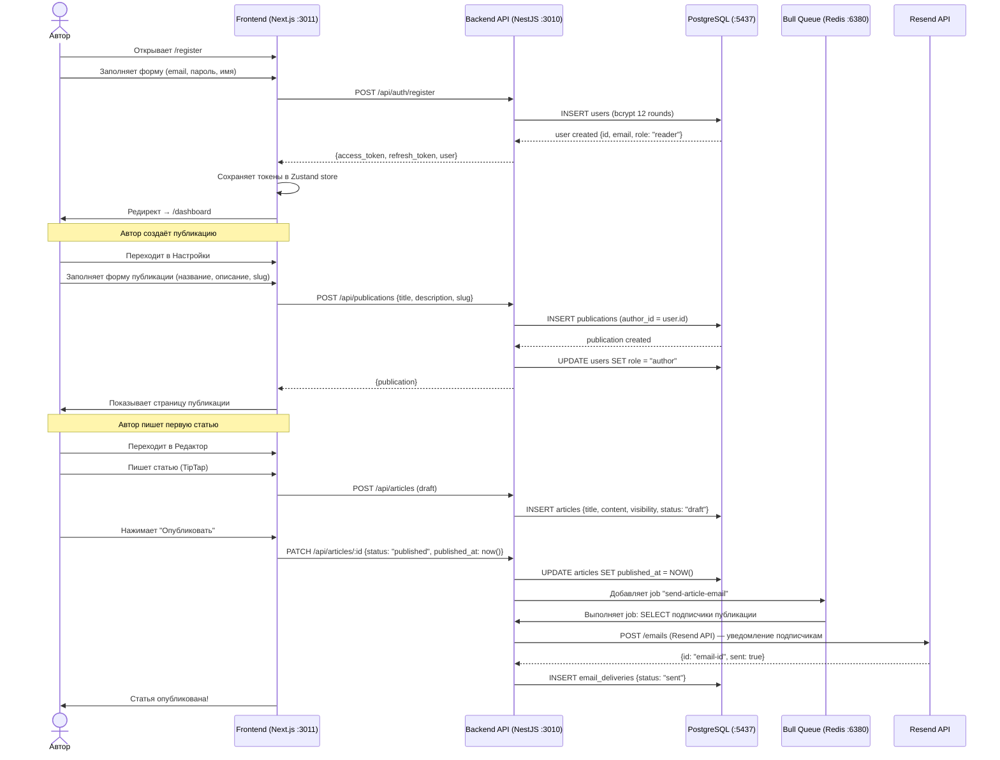
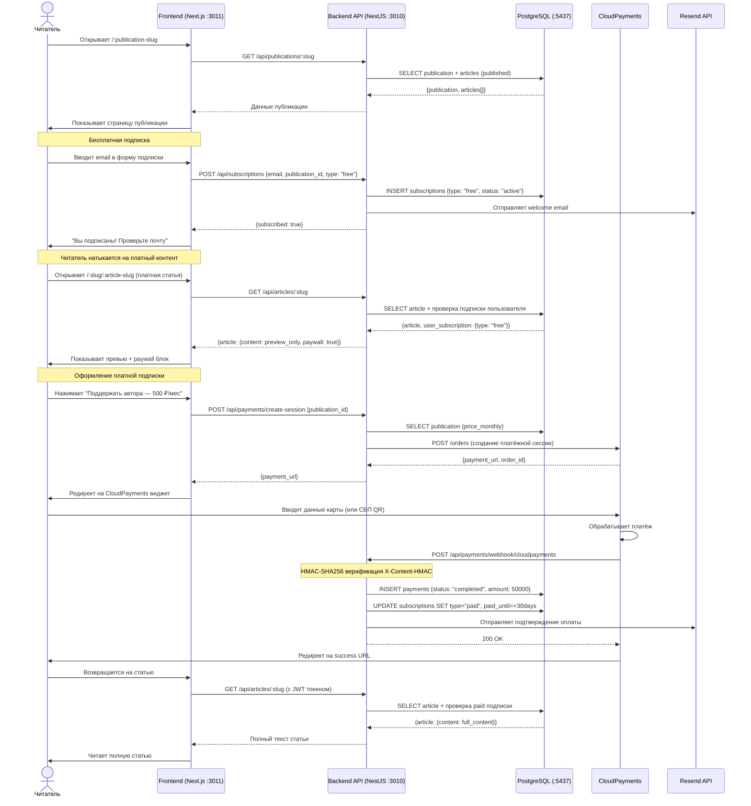
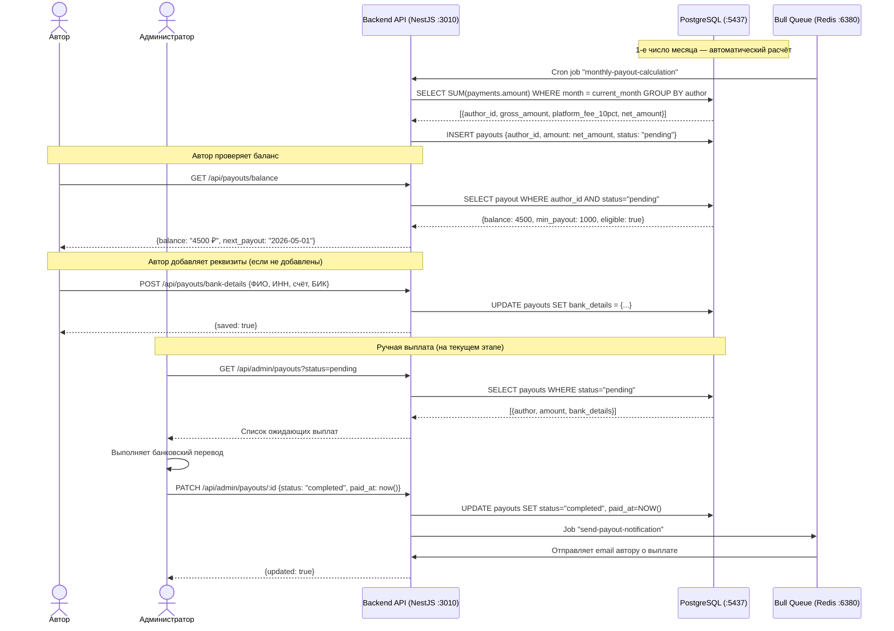
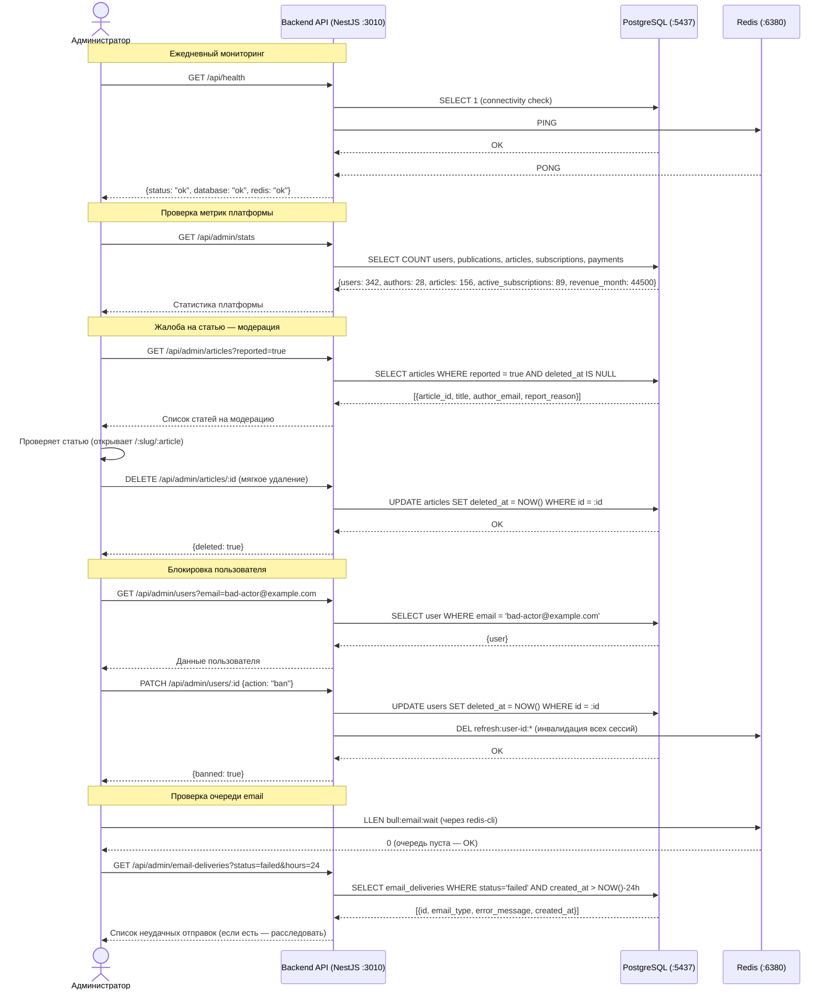
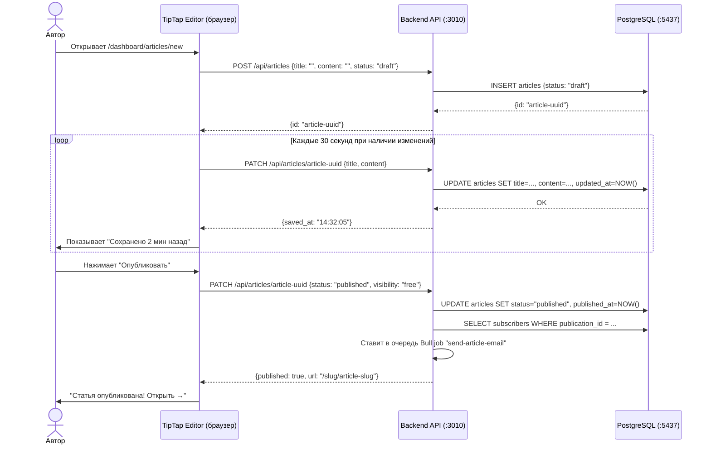

# Пользовательские сценарии SubStack RU

## Сценарий 1: Автор — регистрация и первая публикация

**Участники:** Новый автор, Backend API, База данных, Resend (email)

---

## Сценарий 2: Читатель — подписка и оплата

**Участники:** Читатель, Frontend, Backend API, CloudPayments, PostgreSQL

---

## Сценарий 3: Выплата автору

**Участники:** Автор, Admin, Backend API, PostgreSQL

---

## Сценарий 4: Администратор — мониторинг и модерация

**Участники:** Администратор, Backend API, PostgreSQL, Redis

---

## Сценарий 5: Работа редактора (автосохранение)

