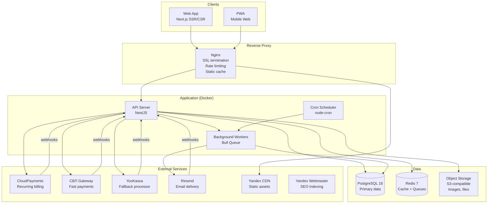

# Architecture: Russian Newsletter Platform

**Дата:** 2026-04-22 | **Фаза:** SPARC Phase 5

---

## 1. Architecture Overview

### Architecture Style

**Distributed Monolith (Monorepo)** — единая кодовая база с чётким модульным разделением, развёрнутая в Docker-контейнерах на VPS в России.

Обоснование:
- Малая команда (3-4 разработчика) → монолит проще поддерживать
- Модульная структура позволяет выделить сервисы позже при масштабировании
- Docker Compose даёт изоляцию без оверхеда Kubernetes
- VPS в РФ → 152-ФЗ комплаенс

### High-Level Diagram



---

## 2. Component Breakdown

### 2.1 Web Application (Next.js)

| Аспект | Решение |
|--------|---------|
| Framework | Next.js 15 (App Router) |
| Rendering | SSR для публичных страниц (SEO), CSR для dashboard |
| Styling | Tailwind CSS |
| State | React Query (server state) + Zustand (client state) |
| Editor | TipTap (ProseMirror-based, Markdown-compatible) |
| Auth | JWT в httpOnly cookie |

**Страницы:**

| Route | Rendering | Auth | Описание |
|-------|-----------|------|----------|
| `/` | SSR | No | Landing page |
| `/:slug` | SSR | No | Publication page (SEO) |
| `/:slug/:articleSlug` | SSR | No | Article page (SEO) |
| `/dashboard` | CSR | Author | Аналитика |
| `/dashboard/articles` | CSR | Author | Список статей |
| `/dashboard/editor` | CSR | Author | Редактор |
| `/dashboard/subscribers` | CSR | Author | Подписчики |
| `/dashboard/payouts` | CSR | Author | Выплаты |
| `/dashboard/settings` | CSR | Author | Настройки |
| `/settings` | CSR | Reader | Подписки читателя |
| `/auth/login` | SSR | No | Вход |
| `/auth/register` | SSR | No | Регистрация |

### 2.2 API Server (NestJS)

| Аспект | Решение |
|--------|---------|
| Framework | NestJS 10 |
| ORM | Prisma (type-safe, migrations) |
| Validation | class-validator + class-transformer |
| Auth | Passport.js (JWT strategy) |
| Rate Limiting | @nestjs/throttler + Redis |
| Docs | Swagger/OpenAPI auto-generated |
| Logging | Winston + structured JSON |

**Modules:**

```
src/
├── auth/           # Registration, login, JWT, email verification
├── publications/   # CRUD, slugs, settings
├── articles/       # CRUD, publishing, scheduling
├── subscriptions/  # Free/paid subscriptions, lifecycle
├── payments/       # CloudPayments, SBP, YooKassa webhooks
├── payouts/        # Monthly calculation, bank transfers
├── email/          # ESP integration, templates, tracking
├── analytics/      # Opens, clicks, growth metrics
├── recommendations/# Co-subscription based engine
├── referrals/      # Referral links, milestones, rewards
├── tips/           # Micro-tipping
├── admin/          # Moderation, RKN compliance
├── common/         # Guards, interceptors, filters, pipes
└── config/         # Environment, feature flags
```

### 2.3 Background Workers (Bull Queue)

| Queue | Задача | Concurrency | Retry |
|-------|--------|:-----------:|:-----:|
| `email-send` | Отправка email через ESP API | 10 | 3x |
| `email-track` | Обработка open/click webhooks | 5 | 1x |
| `payment-process` | Обработка payment webhooks | 3 | 3x |
| `payout-calculate` | Месячный расчёт выплат | 1 | 1x |
| `recommendation-compute` | Пересчёт co-subscription matrix | 1 | 1x |
| `article-render` | Рендер Markdown → HTML | 5 | 2x |
| `seo-sitemap` | Генерация sitemap.xml | 1 | 1x |
| `image-resize` | Ресайз загруженных изображений | 3 | 2x |

### 2.4 Cron Scheduler

| Job | Расписание | Описание |
|-----|-----------|----------|
| Scheduled articles | Every 1 min | Публикует статьи с `scheduled_at <= NOW()` |
| Subscription expiry | Every 1 hour | Переводит expired subscriptions |
| Grace period check | Every 6 hours | Retry failed payments, expire grace |
| Payout calculation | 1st of month | Считает выплаты за прошлый месяц |
| Recommendation matrix | Daily 3:00 AM | Пересчитывает co-subscriptions |
| Sitemap regeneration | Daily 4:00 AM | Обновляет sitemap.xml |
| Email bounce cleanup | Weekly | Деактивирует bounced emails |

---

## 3. Technology Stack

| Layer | Technology | Version | Rationale |
|-------|-----------|---------|-----------|
| **Frontend** | Next.js | 15 | SSR для SEO, React ecosystem |
| **Styling** | Tailwind CSS | 4 | Utility-first, fast iteration |
| **Editor** | TipTap | 2 | ProseMirror, Markdown, extensible |
| **Backend** | NestJS | 10 | TypeScript, modular, enterprise-ready |
| **ORM** | Prisma | 6 | Type-safe, migrations, PostgreSQL |
| **Database** | PostgreSQL | 16 | JSONB, full-text search, reliability |
| **Cache/Queue** | Redis | 7 | Sessions, Bull queues, rate limiting |
| **Queue Library** | Bull | 5 | Redis-backed, retries, priorities |
| **Object Storage** | MinIO (self-hosted) | Latest | S3-compatible, images/files |
| **Email ESP** | Resend | API v3 | Russian ESP, high deliverability |
| **Payments** | CloudPayments | API | Recurring subscriptions, Mir, SBP |
| **Payments (backup)** | YooKassa | API v3 | Широкий охват методов |
| **Reverse Proxy** | Nginx | 1.25 | SSL, rate limiting, caching |
| **Containerization** | Docker | 25 | Isolation, reproducibility |
| **Orchestration** | Docker Compose | 2.x | Multi-container, VPS-native |
| **Monitoring** | Sentry | Latest | Error tracking |
| **Metrics** | Prometheus + Grafana | Latest | System metrics, dashboards |
| **Logging** | Winston + Loki | Latest | Structured logs, search |
| **CI/CD** | GitHub Actions | — | Build, test, deploy to VPS |
| **Language** | TypeScript | 5.4 | Type safety across stack |

### ADR-001: Monorepo over Microservices

**Status:** Accepted
**Context:** Team of 3-4 developers building MVP in 3 months
**Decision:** Distributed Monolith in monorepo (Turborepo)
**Rationale:**
- Single deployment unit → simpler ops
- Shared types between frontend and backend
- Module boundaries enforce separation without network overhead
- Can extract services later when bottlenecks emerge
**Consequences:**
- Must enforce module boundaries via linting (no cross-module imports without explicit exports)
- Single failure domain (mitigated by Docker restart policies)

### ADR-002: PostgreSQL over alternatives

**Status:** Accepted
**Context:** Need relational storage with JSONB flexibility
**Decision:** PostgreSQL 16
**Rationale:**
- JSONB for article metadata, analytics aggregations
- Full-text search (tsvector) for article search without Elasticsearch
- Mature ecosystem (Prisma, pg-boss, etc.)
- Strong community, well-documented
**Consequences:**
- Need connection pooling (PgBouncer) at scale
- Vertical scaling first, read replicas later

### ADR-003: Resend over Amazon SES

**Status:** Accepted
**Context:** Email delivery for Russian market
**Decision:** Resend as primary ESP
**Rationale:**
- Russian company, CIS-optimized deliverability
- SMTP + API, transactional + marketing
- Webhook support (open, click, bounce, complaint)
- Better inbox placement for mail.ru, yandex.ru domains
**Consequences:**
- Vendor lock-in on email templates (mitigated by standard MJML)
- Cost grows with volume (switch to dedicated IP + Postfix at 1M+/day)

---

## 4. Data Architecture

### Database Schema (simplified ERD)

```
User 1──N Subscription N──1 Publication
  │                           │
  │                           1
  │                           │
  │                           N
  │                        Article
  │                           │
  │                           1
  │                           │
  N                           N
Referral                  EmailDelivery

Publication 1──N Payment
Publication 1──N Tip
Publication N──N Publication (Recommendation)

User 1──N Payout
```

### Storage Strategy

| Тип данных | Хранение | Retention |
|-----------|----------|-----------|
| User, Publication, Subscription | PostgreSQL | Бессрочно |
| Articles (content) | PostgreSQL (text) | Бессрочно |
| Images, files | MinIO (S3-compatible) | Бессрочно |
| Email delivery logs | PostgreSQL | 90 дней (архив в cold storage) |
| Analytics aggregates | PostgreSQL (materialized views) | Бессрочно |
| Sessions, cache | Redis | TTL-based |
| Queues | Redis (Bull) | Until processed |
| Logs | Loki | 30 дней |

### Backup Strategy

| Компонент | Метод | Частота | Retention |
|-----------|-------|---------|-----------|
| PostgreSQL | pg_dump + WAL archiving | Daily full + continuous WAL | 30 дней |
| MinIO | rsync to secondary VPS | Daily | 14 дней |
| Redis | RDB snapshots | Every 6 hours | 7 дней |

---

## 5. Security Architecture

### Authentication Flow

```
[Browser] → POST /api/auth/login {email, password}
                    ↓
            [API: validate credentials]
                    ↓
            [bcrypt.compare(password, hash)]
                    ↓
            [Generate JWT (15min) + Refresh Token (30d)]
                    ↓
            [Set httpOnly cookies: access_token, refresh_token]
                    ↓
            [Response: { user }]
```

### Authorization (RBAC)

| Role | Permissions |
|------|------------|
| `reader` | Read articles, subscribe, manage own subscriptions, tip |
| `author` | All reader + publish, manage publication, view analytics, payouts |
| `admin` | All author + moderation, user management, platform analytics |

### Security Measures

| Measure | Implementation |
|---------|---------------|
| Password hashing | bcrypt, 12 rounds |
| JWT | RS256, 15 min expiry, httpOnly cookie |
| Refresh token | Random 256-bit, 30 day expiry, stored in DB, rotated on use |
| CSRF | SameSite=Strict cookies + X-CSRF-Token header |
| XSS | Content-Security-Policy, HTML sanitization (DOMPurify) |
| SQL Injection | Prisma parameterized queries (ORM-level protection) |
| Rate Limiting | 100 req/min per IP (auth), 1000 req/min per user |
| Webhook verification | HMAC-SHA256 signature for each processor |
| PCI compliance | Card data never touches our servers (tokenization via CloudPayments) |
| Data encryption at rest | AES-256 for PII fields (bank accounts, ИНН) |
| TLS | 1.3, enforced via Nginx, HSTS |
| 152-ФЗ | All PD stored on Russian VPS, consent logs, right to delete |

---

## 6. Infrastructure

### VPS Configuration (MVP)

| Server | Specs | Role | Monthly Cost |
|--------|-------|------|:------------:|
| app-01 | 4 vCPU, 8GB RAM, 100GB SSD | App + API + Workers | ~₽3,000 |
| db-01 | 4 vCPU, 16GB RAM, 200GB SSD | PostgreSQL + Redis | ~₽5,000 |
| storage-01 | 2 vCPU, 4GB RAM, 500GB HDD | MinIO + Backups | ~₽2,000 |
| **Total** | | | **~₽10,000/мес** |

### Docker Compose Services

```yaml
services:
  nginx:        # Reverse proxy, SSL, rate limiting
  app:          # Next.js + NestJS (unified container)
  worker:       # Bull queue workers
  scheduler:    # Cron jobs
  postgres:     # Database
  redis:        # Cache + queues
  minio:        # Object storage
  sentry:       # Error tracking (self-hosted optional)
  prometheus:   # Metrics collection
  grafana:      # Dashboards
  loki:         # Log aggregation
```

### Deployment Flow

```
Developer → git push → GitHub Actions:
  1. Run tests (unit + integration)
  2. Build Docker images
  3. Push to private registry
  4. SSH to VPS → docker compose pull && docker compose up -d
  5. Run database migrations (prisma migrate deploy)
  6. Health check → rollback if unhealthy
```

---

## 7. Scalability Considerations

### Phase 1: Single VPS (MVP, 0-10K users)

- Все на одном-двух VPS
- PostgreSQL без реплик
- Redis single instance
- Email через ESP API (Resend)

### Phase 2: Vertical Scaling (10K-100K users)

- Увеличить RAM/CPU на db-01
- Добавить PgBouncer для connection pooling
- Redis Sentinel для HA
- Dedicated email IP + warm-up

### Phase 3: Horizontal Scaling (100K+ users)

- PostgreSQL read replica для analytics queries
- Отдельный worker-сервер для email queue
- CDN для всех статических ассетов
- Рассмотреть managed PostgreSQL (Yandex Cloud)
- Email: switch to dedicated Postfix + DKIM signing server

### Bottleneck Analysis

| Компонент | Bottleneck point | Metric | Mitigation |
|-----------|-----------------|--------|------------|
| Email delivery | >50K emails/day | Queue depth | Batch API, dedicated worker VPS |
| PostgreSQL | >1M rows in EmailDelivery | Query time | Partitioning by month, archival |
| API | >500 concurrent users | Response time | Horizontal scaling (2 app VPS + load balancer) |
| Storage | >100GB images | Disk I/O | CDN offload, image optimization pipeline |

---

*SPARC Phase 5: Architecture. Distributed Monolith, Docker Compose, VPS Russia, 12 services, 3 ADRs, security + scaling plan.*
